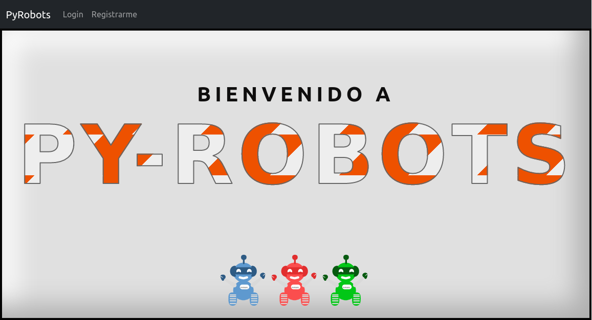
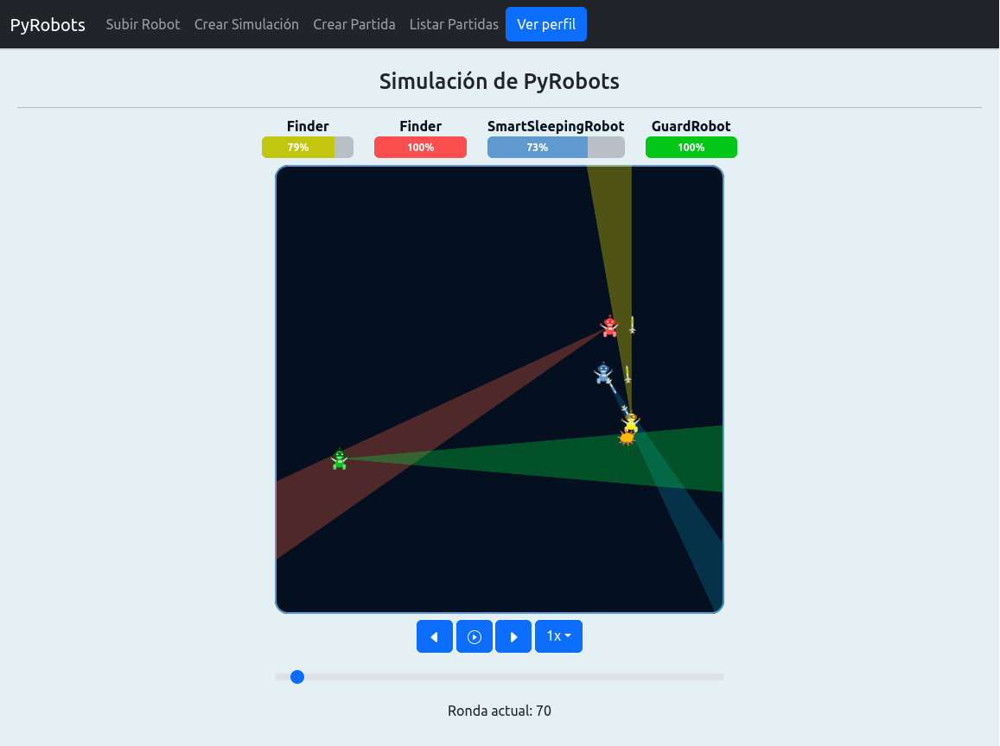

# PyRobots by GranSoldador :robot:

Este proyecto tuvo lugar entre septiembre y noviembre 2022, como parte del
cursado de la materia "Ingeniería del Software 1" de FaMAF - UNC.

Los requerimientos solicitados se completaron en su totalidad, y pueden verse en el archivo
[Enunciado](Enunciado.md) de este repositorio.

## El equipo :muscle:

### Frontend :paintbrush:
- [@kevmansilla](https://github.com/kevmansilla)
- [@NVeronicaL](https://github.com/NVeronicaL)
- [@lautiramirez](https://github.com/lautiramirez)
- [@Frod0M](https://github.com/Frod0M)

### Backend :hammer_and_wrench:
- [@LeandroLopez013](https://github.com/LeandroLopez013)
- [@RooCordoba](https://github.com/RooCordoba)
- [@luigig44](https://github.com/luigig44)

## El proyecto :computer:

> PyRobots es un juego para programadores. A diferencia de los juegos de tipo arcade, los que requieren el input humano para controlar algún objeto, toda la estrategia de PyRobots debe ser completada antes de que el juego comience. La estrategia del juego se condensa en un programa en Python que debes diseñar y escribir. Tu programa controla un robot cuya misión es buscar, seguir y destruir otros robots, cada uno ejecutando diferentes programas. Cada robot está igualmente equipado, y pueden competir hasta 4 robots al mismo tiempo.
>
> Cada robot dispone de funciones para scanear enemigos, iniciar y detener el motor, disparar cañones, etc. Luego de que se inician los robots, cada uno ejecutando un programa, se puede observar la batalla. Robots moviéndose, misiles volando y explotando, y cierta información de status en tiempo real.

### Detalles :mag:

- Desarrollado siguiendo metodología Scrum
- Frontend en React + Axios + Bootstrap
- Backend Python usando FastAPI + PonyORM
- API RESTful + comunicación en vivo vía WebSocket

### Screenshots :framed_picture: 	

Página de inicio

Visualización de simulación
